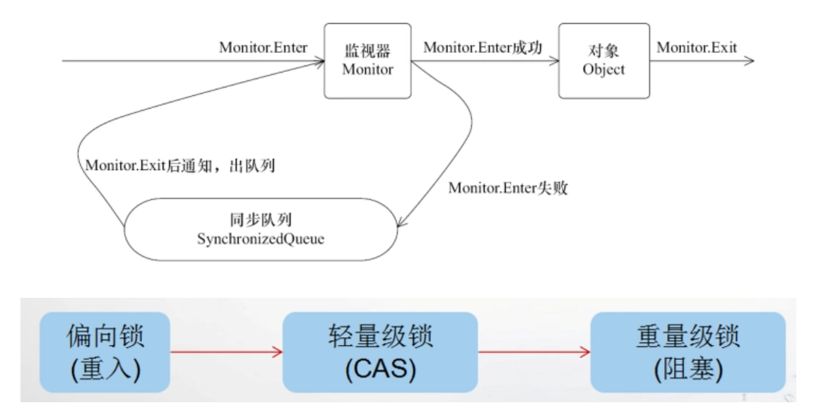

# synchronized的应用方式

|  形式   | 锁  |
|  ----  | ----  |
| 同步方法块(对象锁)  | 括号里的对象 |
| 普通同步方法(对象锁)  | 当前实例对象 |
| 静态同步方法(对象锁)  | 当前类的class对象 |

# 原理

**每个对象头都有监视器，记录着锁的信息。** 

- A线程进来，判断是否有其他线程获取锁，如果没有，获取锁。
- A线程进来（另外一个方法或者递归），判断是否有其他线程获取锁，如果有，判断是否是当前线程，如果是，允许获取锁，此时锁为偏向锁。
- B线程进来，判断是否有其他线程获取锁，如果有，判断是否是当前线程，如果不是，自旋，通过CAS判断是否获取锁，此时锁为轻量级锁。
- C线程进来，步骤同B，如果CAS也没获取锁，则升级到重量级锁，此线程进入同步队列等待。 当其他线程执行完，会唤醒同步队列头节点的线程