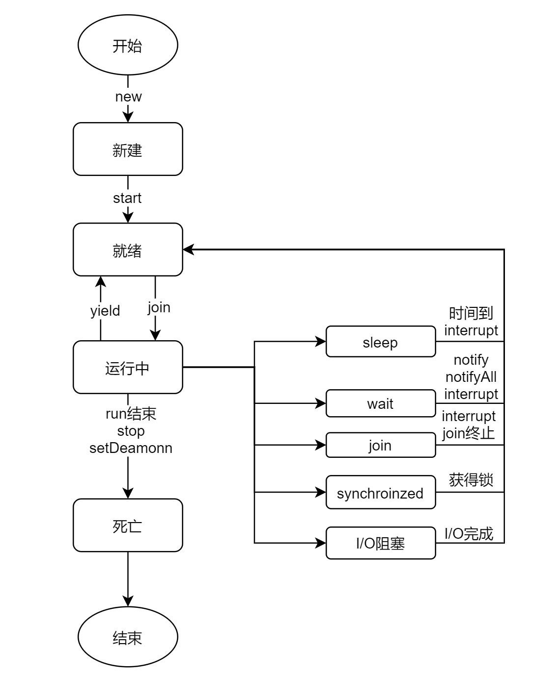

# 流程图

# 一：线程状态简介

## 1.1：新建状态

> 当用new创建一个线程后，线程就处于新建状态，此时和其他普通java对象一样，由JVM创建内存空间，初始化成员变量值等。

## 1.2：就绪状态

> 调用strat或者由阻塞状态被解除时，进入就绪状态，此时，只能表示线程可以运行了，但不代表已经运行了，需要等待CPU的调度。

## 1.3：运行状态

> 在就绪状态的线程，获取到调度后，就到了运行状态，但是不一定一直维持运行状态。

## 1.4：阻塞状态

> 包括sleep、wait，join，synchronized,I/O堵塞等，当前线程进入堵塞状态时，其他线程可以获得执行的机会。

## 1.5：死亡状态

> 当线程执行run结束、stop、setDeamon或者异常等，线程就会结束，进入死亡状态。

# 二：start与run

> 执行start方法，是用来启动线程的，此时线程处于就绪状态，获得调度后运行run方法。run方法执行结束，线程就结束。 执行run方法，相对于普通方法调用，在主线程调用。程序是顺序执行的，执行完才会执行下面的程序。

# 三：yield

## 3.1：方法作用

> 让当前的线程状态从运行状态转到就绪状态，然后和其他就绪状态的同相同优先级的其他线程竞争CPU的执行权。也就是说，这个线程，还是有机会继续再次执行的。

## 3.2：优先权

> 优先级范围是1~10，数字越大，优先级越高，默认为5，但是由于操作系统等其他因素，优先级不一定生效。

## 3.3：示例

暂无

## 3.3：应用场景

暂无

# 四:join

## 4.1：定义

> 等待该线程终止，比如A线程调用了B线程的join，那么A线程要等到B线程执行完后，才可以继续执行

# 五：sleep

> 在指定毫秒数内，让正在执行的当前线程进入休眠期。

# 六：wait,notify,notifyall

## 6.1：sleep和wait

- sleep是Thread类的方法，wait是Object的方法。
- sleep可以到处使用，wait必须是在同步方法或者代码块里使用，不然会有java.lang.IllegalMonitorStateException异常。
- sleep不释放持有的锁，wait释放锁。wait在调用方法前，必须持有锁，调用notify,notifyall唤醒，也要持有锁。
- sleep休眠一定时间后，进入就绪状态。wait由notify和notifyall唤醒。
- 这两个都能被interrupt方法中断当前状态。

## 6.2：join和yield

- 这两个和sleep一样，不释放持有的锁。