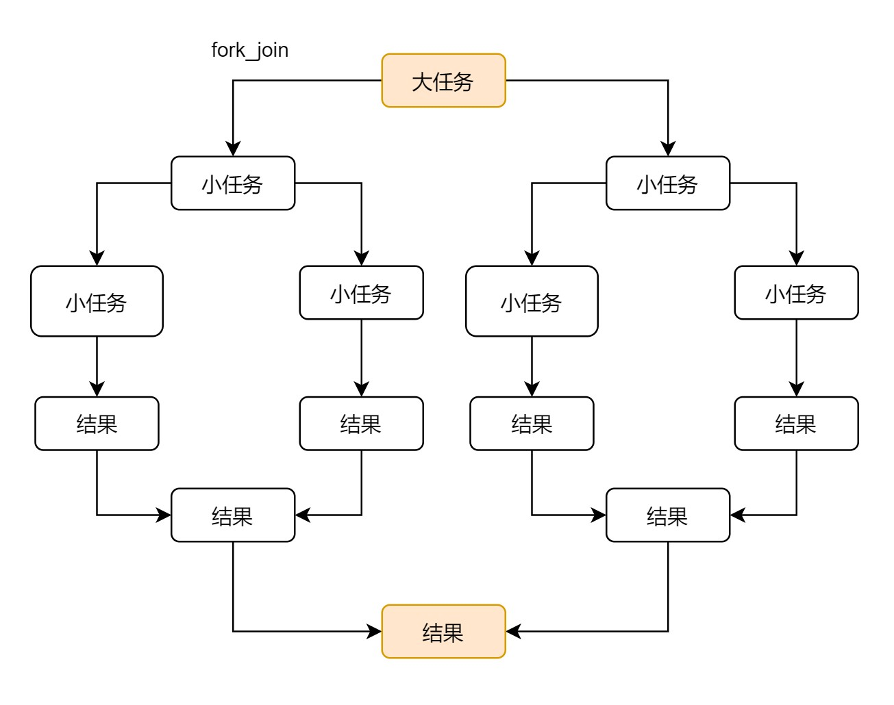
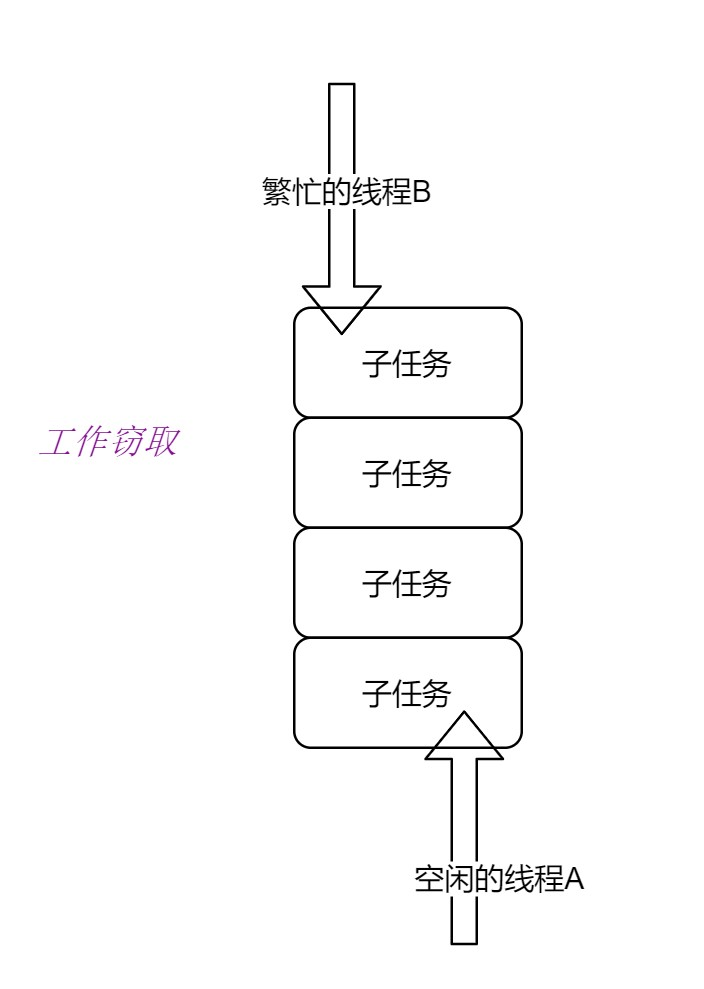

## 一：思想

> 把大任务分割成多个小任务，再把小任务的结果汇总，最终得到大任务的结果。

### 步骤如下：

> 任务分割
 
> 结果汇总

## 二:示例图：

## 三：工作窃取

> 指的是线程从其他线程窃取任务来执行。
> 当一个大任务分割成多个小任务的时候，为了减少线程之间的竞争，把小任务放在不同的队列里，每个队列都分配一个线程来执行任务。
> 当一个线程执行完当前队列的任务时，他就会去窃取其他队列的任务来执行。由于都是同一个队列执行小任务，为了减少线程之间的竞争，窃取任务的时候，从队列的尾部拿任务。

**优点：充分利用了线程的计算，减少线程之间的竞争** 
**缺点：消耗系统资源，比如创建线程和多个双端队列。 当双端队列只有一个任务时，线程之间会竞争。**

## 四：java类

### ForkJoinTask

实现了Future的接口，主要的子类有 RecursiveAction和RecursiveTask。

- RecursiveAction：没有返回值
- RecursiveTask：有返回值

主要的方法：

- fork():再创建一个子任务
- invoke():执行任务
- join()：返回计算后的结果

ForkJoinPool

- 通过调用invoke来执行ForkJoinTask的任务。

### 4.1 ForkJoinRecursiveTask

### 4.2 ForkJoinRecursiveAction

### 4.3 ForkJoinCountDownLatch

### 4.4 ForkJoinCyclicBarrier

- 作用

> 屏障拦截，构造参数可以传递拦截的线程数量，以及拦截后调用的Runnable类。每当线程调用await方法的时候，就告诉CyclicBarrier已经到达了屏障，然后阻塞在那边，等全部线程都到达了屏障，线程开始执行。

- 主要方法

> await：告诉CyclicBarrier已经到达了屏障

#### 4.5CountDownLatch和CyclicBarrier
- CountDownLatch可以一个线程执行多次countDown，CyclicBarrier执行多次是无效的。
- CountDownLatch是由外部决定下一步的，CyclicBarrier是由多个线程自己决定下一步的。
- 比如上课点名，有些老师很随意，只要人数满了，就开始上课，不管有部分学生变音喊到，都记有人来上课，这个时候就是CountDownLatch。有些课程没有老师，位置坐满人了，AI播放视频开始上课，这个时候就是CyclicBarrier。